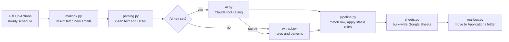

# JobTracker

[](https://github.com/angelikiKissani/JobTracker/actions/workflows/tests.yml)


An automated pipeline that reads job-application emails from my inbox, works out
what each one means, and keeps my job-search tracker in Google Sheets up to date —
no manual data entry.

Every hour, a GitHub Actions workflow checks for new emails, recognises
application confirmations, recruiter calls, interview invitations, rejections and
offers, and updates the matching row in the tracker. It runs entirely in the
cloud, for free.

## Features

- **Automatic status tracking** — new applications are added; later emails move
  them through *Applied → Recruiter Screen → Interview → Offer / Rejected*.
  Statuses never move backwards (an old confirmation can't undo an interview).
- **Two extraction engines**
  - **Rule-based** (default, free): keyword rules, sender-domain analysis and
    pattern matching on subjects and bodies.
  - **LLM-based** (optional): Claude reads each email and returns structured
    data via tool calling — company, title, status, interview time, contact,
    location, summary and next step. Falls back to rules on any failure.
- **Entity resolution** — emails from job platforms (Indeed, Workable,
  LinkedIn…), company domains, aliases (`eurodyn` → *European Dynamics*) and known
  interviewers are all matched to the same application, so three confirmation
  emails for one job produce one row.
- **Email archive** — each job email is copied into an *Emails* tab and linked
  from its tracker row; the job-posting link is extracted when present.
- **Inbox organisation** — processed job emails are moved to an *Applications*
  folder, only after they are safely recorded.
- **Incremental and idempotent** — tracks the last processed IMAP UID, so each
  email is handled exactly once, even across failures.

## Architecture



| Module | Responsibility |
|---|---|
| `config.py` | All settings: sheet layout, status rules, aliases, platform lists |
| `mailbox.py` | IMAP connection, incremental UID search, moving emails |
| `parsing.py` | Header decoding, plain-text / HTML extraction, encodings |
| `extract.py` | Rule-based status classification, company and title extraction |
| `ai.py` | Optional LLM extraction with a strict JSON schema |
| `sheets.py` | In-memory model of the sheet with batched writes |
| `pipeline.py` | Orchestration: one email in, one `Result` out |

The core logic (`process_message`) is pure: it takes an email and an in-memory
tracker and returns a result, which makes it fully testable without network access.

## Tech stack

Python 3.12 · IMAP · Google Sheets API (gspread) · Anthropic API (optional) ·
GitHub Actions · pytest · ruff

## Setup

1. **Google Sheets** — create a service account in Google Cloud, enable the
   Sheets API, and share your sheet with the service account's email.
2. **Mail** — create an app-specific password for your iCloud account.
3. **GitHub secrets** (*Settings → Secrets and variables → Actions*):

| Secret | Description |
|---|---|
| `ICLOUD_EMAIL` | Your iCloud Mail address |
| `ICLOUD_APP_PASSWORD` | App-specific password |
| `GOOGLE_SERVICE_ACCOUNT_JSON` | Full contents of the service-account key file |
| `SPREADSHEET_ID` | The ID from the sheet's URL |
| `ANTHROPIC_API_KEY` | *Optional* — enables AI extraction |

4. Run the **Job tracker** workflow from the *Actions* tab, or wait for the hourly run.

## Development

```bash
pip install -e ".[dev]"
pytest -v        # unit and pipeline tests
ruff check .     # linting
```

Every push runs the test suite and linter in CI.

## Privacy

Credentials live only in GitHub encrypted secrets, and personal data stays in a
private Google Sheet; nothing personal is stored in this repository. Emails are
read without being marked as read, and only emails that look job-related are
processed (and, when AI is enabled, sent to the model).

## Roadmap

- [x] Rule-based extraction and Google Sheets sync
- [x] Optional LLM extraction with structured output
- [x] Package structure, tests and CI
- [ ] Train a custom ML classifier (TF-IDF + logistic regression) on labelled emails
- [ ] Analytics: application funnel, response rates by source, time-to-response
- [ ] Synthetic demo dataset so anyone can run the analysis
